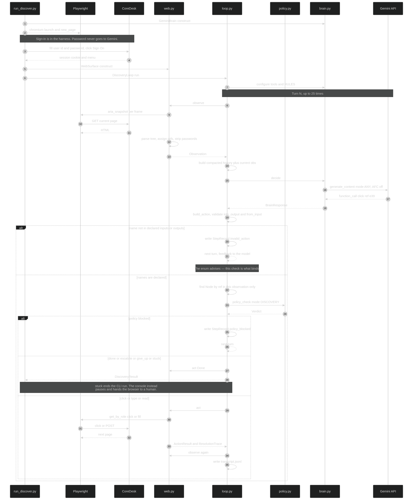
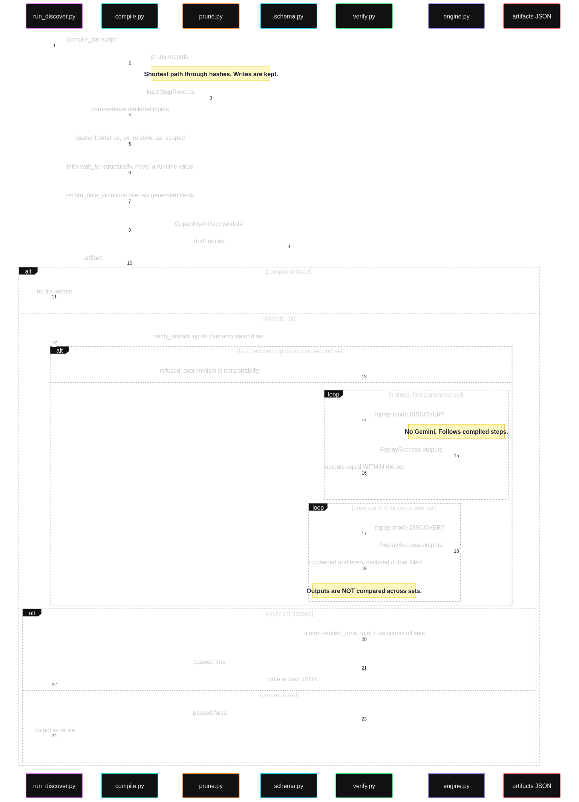
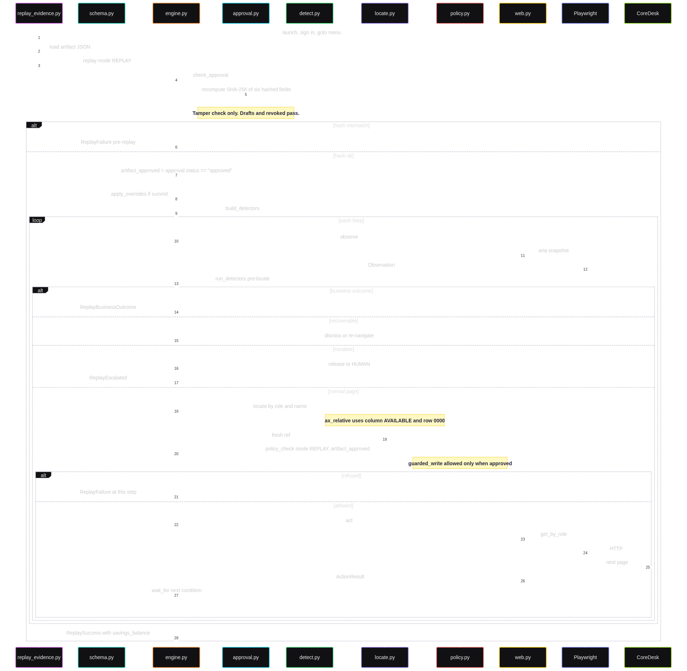

# CoreDesk — Design Report

## 1. Architecture

A discovery run of `read_savings_balance` costs ~14,000 tokens and nine
seconds.  Replay costs zero tokens and 1.8 seconds, and a test unsets the API
key and injects a client that raises on any call to prove it.  An agent
invoking this hundreds of times a day across tens of institutions cannot pay a
model to rediscover `MBRINQ` each time — and a risk committee cannot approve a
transcript, only a typed artifact.

Three sequence diagrams: discovery, compile and verify, replay.

A capability is promoted, not produced: the model proposes, a machine gate
proves it replays, a human gate approves it against a content hash, and only
then does it run unattended.  Two are approved — one reads a balance, one
changes an address and returns the confirmed value.  The model sees roles and
accessible names, never HTML or selectors.  One action vocabulary (`navigate`,
`click`, `type`, `select`, `read`, `done`, `escalate`, `give_up`) is at once the
tool schema, the artifact step type and the replay instruction set.  Policy is
one function both paths call; `replay/` never imports the Gemini SDK;
`coredesk/` does not know it is being automated.

## 2. Artifact schema

A reviewer who never sees the source answers five questions from the JSON: what
it does (`steps[].intent`), what it needs (`inputs`), what it returns
(`outputs`, money as integer cents), what else can happen (`known_outcomes`),
and what happens if it cannot finish (`checkpoint`, `escalation_policy`).

Each target is a strategy-tagged object (`ax`, `ax_relative`, `ax_scoped`),
never a selector string.  Known outcomes live in the artifact, not the engine,
so the caller's contract is complete without reading code.  Tenant overrides are
keyed by `step_id` and assert `from_value` before writing `to_value` — a silent
no-op on Summit would read the wrong column.  Writing one artifact by hand
before building the compiler surfaced a positional bug (`row_source: "first"`)
that reading the schema had not.  The read artifact declares two outcomes it can
actually produce; three were removed because the read path cannot fire them, and
a capability declaring outcomes it cannot detect is a promise the engine cannot
keep.

## 3. Determinism & error handling

Each bug below is the subtle version of the failure this project exists to
prevent, and what caught it matters as much as the bug: a live fault injection,
a hand-written artifact, a rendered review screen, a first write capability.

**The locator that contained the answer.**  The ladder checked `ax_scoped`
before `ax_relative`, so the read step recorded cell `"12,845.50"` — correct on
member 100101, wrong on every other, the balance baked into the locator.  Order
is now `ax` → `ax_relative` → `ax_scoped`.

**The retry that did nothing.**  Recovery re-observed the current page, and
`observe()` reads an already-loaded accessibility tree rather than fetching.  A
no-op that would have passed review and mocked tests; only a live `db_timeout`
injection caught it.  Recovery now re-navigates.  Known limit: that re-request
is a GET, so a transient error after POST will not re-submit.

**The gate that would have passed green.**  Renaming the balance column to
`STATUS` returns `"OPEN"` where money was expected — no locate error, so only
output comparison and type coercion catch it.  Renaming it to `LEDGER` passed
green on 100101, whose available and ledger balances are equal.  We were told
the gate might be weak, ran it deliberately, and confirmed it.  It was replaced
by the STATUS variant plus a unit test on a row where the two differ.

**The pruner that deleted a real step.**  Identical consecutive observation
hashes looked like a loop; one was a navigation the next step needed.  Anything
not provably a loop is now flagged, not deleted.

**The intent that described one member.**  `_make_intent` built its sentence
from the *observed* element name, which for an `ax_relative` cell is the value
being read: `Read cell "12,845.50" into savings_balance`.  Unlike the locator
bug it never fails, and §2 says a reviewer answers "what does this do?" from
`intent` — a quiet wrong answer in the field built to prevent them, found only
by rendering the review screen.  The same value had leaked into `step_id`
(`read_12_845_50`), which keys tenant overrides and appears in every diagnostic.
Both now derive from the locator and the output name.

**Record data in fields meant to describe structure.**  Five times: `intent`
and `step_id` held the balance; `card.lock`'s `row_key` held a member number
inside a card id; an effective date froze as a literal; `wait_for.name` held the
city, so an address capability waited for `cell "Tempe"` and timed out
everywhere else — after passing verification twice.  Four were patched
individually before the rule was stated: **no compiler-generated field may
contain a value the capability reads into an output or takes as an input.**  One
check over six fields, not five over five.  The fifth is instructive:
`_infer_wait` already had the structural fallback and a docstring giving the
reason, applied to the cross-frame branch and not the same-frame branch beside
it.  Not four missing insights — one insight applied narrowly four times.

The same shape appeared four more times in fields nobody read — `DriftSignal`
constructed nowhere, `artifact_approved` never passed, `review_required` never
rendered, an enum declared to the model but never enforced on what came back —
and twice in the review console itself, which picked the first match on an
ambiguous key and told a viewer *this is a gate refusing, not a crash* over the
top of a crash.  The enum was the costly one: an undeclared input reached
`self._inputs.get(name, "")` and typed an **empty string** into the address
form, blanking a member record while the run reported success.

Each time, the schema carried more than the system used.  A typed contract is
not self-enforcing: a field nobody reads is indistinguishable from a field
always empty, and a constraint nobody checks from a suggestion.

The engine returns `success`, `business_outcome`, `failure` or `escalated`, and
a caller pattern-matches on `status` — "member 999999 does not exist" is not an
error.  `NO_SAVINGS_ACCOUNT` has no page-level message: it requires the shares
table present *and* row `0000` absent, where matching the locate-error string
would report "no savings" for a broken iframe.  A recovery that does not appear
in the step trace is indistinguishable from nothing having happened.

## 4. Heterogeneity & multi-tenant

Same product, two configurations.  Summit renames the menu (`INQ01`), the member
field (`Member ID`), the select link (`VIEW`) and the balance header
(`AVAIL BAL`), and swaps JOINED and BRANCH on the results grid.  A positional
locator reads a plausible value from the wrong column and does not error.

One artifact carries a small `overrides.summit` block, and replay applies
overrides *after* the approval hash check.  Applied first, the patched steps
would not match the stored digest and Summit could never run; applied after, the
hash binds to the base artifact plus the override block, so approving once
covers every tenant.

The first Summit run timed out because `wait_for` still expected Riverbend's
"Member Number" — target-only patches are not enough.  Detection fields do not
have the same gap: `NO_SAVINGS_ACCOUNT` looks for table `"Share accounts"`, and
that `<caption>` is hardcoded.  Gate: `evidence/replay-cross-tenant/`, both
tenants, both `12,845.50`.

## 5. Escalation & handoff

Ownership is `AUTOMATION | HUMAN | NONE` behind a lock.  `Surface.act()` asserts
`AUTOMATION` before touching the browser, and a test proves it returns
`not_owner` while ownership is `HUMAN`.

Escalation is a fourth result status, not a blocking wait inside `replay/`.  The
engine releases the lock on the visible window, clears the `X-CoreDesk-Actor`
header so CoreDesk's audit log writes `HUMAN`, and returns an
`InterventionRequest` carrying the step intent and concrete instructions.
Resume re-validates the current step's target and fails with a diagnostic saying
where the operator should be.  `evidence/replay-escalation-resume/` is the full
loop: session expired, human signed in on the raw page, resume completed.  The
header follows the lock, so the audit trail shows where automation stopped.

The console renders that request — intent, reason, screenshot, URL — with
ownership read from the attribute `act()` actually checks, not a second copy of
the state.  The human acts in the Playwright window; the console carries only
the Resume signal, and refuses to start a second run while one is escalated.

## 6. Safety

The machine gate must pass before the human gate: `approve()` refuses when
`verified_runs` is unset.  That field is stamped only by `verify_artifact` and
counts every run across every parameter set — 3 for both approved capabilities.

Approval is a SHA-256 of every field that affects execution; replay recomputes
it and refuses on mismatch before a step runs, and writing a modified approved
artifact raises rather than silently demoting to draft.

The `guarded_write` tier was specified, tested, and unreachable until the first
write capability existed — `policy_check` allows a guarded write only when told
the artifact is approved, and the engine never told it.  Five safe steps never
reach that branch, which is why a read-only capability could not surface it.
`evidence/replay-address-update/` is the tier working: an approved artifact
changes an address, an audit row records `actor=AUTOMATION`, the same artifact
as a draft is refused.

**Approval gates writes, not execution.**  `check_approval()` passes drafts and
revoked artifacts alike — it enforces hash validity only on artifacts *claiming*
approval, making it a tamper check rather than an authorisation.  A draft runs
its safe steps and is refused where it would change something, at the step
rather than at `(pre-replay)`.  Two tests pin that; asserting the assumption
instead would leave a suite that passes whether or not the gate runs at all.

Nobody types a password into this system.  Password values are stripped from the
accessibility tree at `Observation` construction, including ancestor names that
concatenate the secret.  The canary `CANARY-A7F3-DONOTLOG` is grepped out of
every write.

## 7. Cuts

**N-run verification proved determinism, not portability.**  It replayed an
artifact N times with identical parameters, and two artifacts passed while valid
only for the record they were recorded against.  Verification now requires two
distinct parameter sets, outputs compared for equality *within* a set and never
*across* one — a capability returning the same balance for two members would be
the bug, not the proof.  `update_address` is the first to pass: 100101 in Tempe,
100114 in Portland.  Two sets is a floor, not a proof of generality — 100112 has
two cards, 100119 a frozen share that must not read as open.

Requiring two sets was a one-function change in `verify_artifact` and a
four-caller change in practice.  Two callers were fixed with it; two were not,
and one of those was the console's discovery flow — the entry point the README
sends a reviewer to first, which would have run the model, compiled, and then
been refused at a gate it never passed a second set to.  Found by grepping every
caller before submission rather than by a reviewer.  Tightening a gate is not
finished when the gate is right.

`card.lock` needs a schema change: its read step is keyed by row
`CRD-100101-1`, a card id embedding the member number, and a locator field
cannot reference a declared input.  The tightened rule refuses to compile it and
the capability was **revoked** — the gate got stricter and something already
through it was pulled rather than grandfathered.

Drift detection is a type, not a mechanism.  `DriftSignal` is plumbed and
nothing constructs one, and `locate()` raises rather than falling back.  A
primary that misses while a fallback succeeds is a run that worked and an app
that moved, and today we would not know.

Ownership is enforced in the wrong place: `control/session_owner.py` holds the
enum and the lock, and `surface/web.py` checks a bare string instead.  Correct
and tested, but two objects that could drift apart.

History is compacted — prior turns collapse to one line, the current observation
is sent in full, taking the six-step run from 31k input tokens to 11k.  Unbuilt
is a strategy for observations individually too large; at 1.9k tokens for the
member record page, the question has not arisen.

Each cut is something we chose not to pretend was done.
